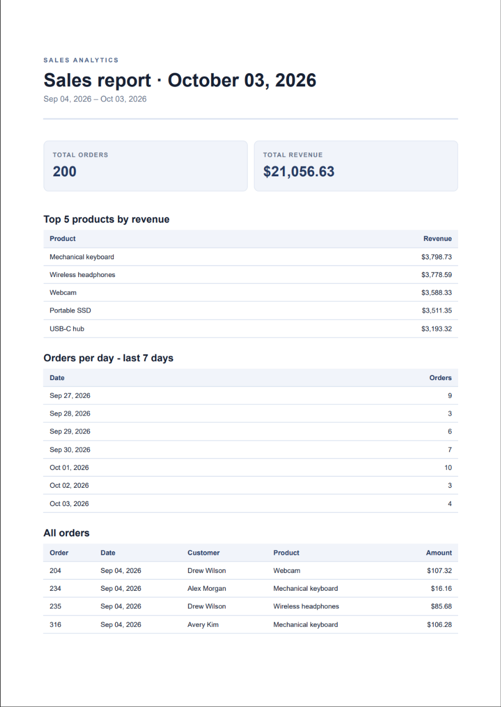

# Sales Report Pipeline

A small FastAPI application that aggregates order data with SQL, renders a
multi-page PDF using a Jinja HTML template and Playwright Chromium, and serves
the saved PDF by link. The generation endpoint is synchronous; the PDF bytes
stay on disk rather than being stored in or returned as JSON.

## Dataset

This project uses **Option A: the little shop**. The seed script creates
`report.db` with an `orders` table and 200 fictional orders across six products.
Each run clears and reseeds the table, so it can be run repeatedly and always
leaves exactly 200 orders. The database and generated PDFs are local artifacts
and are intentionally excluded from Git; `app/seed_data.py` is the recipe for
recreating the data.

## Run locally

Prerequisites: Python 3.10 or newer. In PowerShell, install dependencies,
install Chromium, seed the database, and start the API:

```powershell
python -m venv .venv
.\.venv\Scripts\Activate.ps1
python -m pip install -r dev-requirements.txt
python -m playwright install chromium
python -m app.seed_data
uvicorn app.main:app --reload
```

The API listens at `http://localhost:8000`; interactive API docs are at
`http://localhost:8000/docs`. The app creates the `reports` bookkeeping table
on startup.

## Aggregation SQL

`get_report_data()` uses these SQL aggregations for the selected inclusive
date range. The daily query covers the latest seven days; the application
fills in dates with no orders as zero.

```sql
-- Totals
SELECT
    COUNT(orders.id) AS total_orders,
    COALESCE(SUM(orders.amount), 0) AS total_revenue
FROM orders
WHERE orders.created_at BETWEEN :start_date AND :end_date;

-- Top five products by revenue
SELECT
    orders.product,
    SUM(orders.amount) AS revenue
FROM orders
WHERE orders.created_at BETWEEN :start_date AND :end_date
GROUP BY orders.product
ORDER BY SUM(orders.amount) DESC, orders.product
LIMIT 5;

-- Orders per day for the latest seven days
SELECT
    orders.created_at,
    COUNT(orders.id) AS orders
FROM orders
WHERE orders.created_at BETWEEN :week_start AND :end_date
  AND orders.created_at BETWEEN :start_date AND :end_date
GROUP BY orders.created_at
ORDER BY orders.created_at;
```

The report also includes the individual order rows for its detailed table.

## Generate and download a report

POST generates a report and returns its `id` and `file` link. Use
`{"force":true}` to explicitly generate a fresh PDF even if today's report
already exists.

```powershell
$response = curl.exe -sS -i -X POST http://localhost:8000/reports `
  -H "Content-Type: application/json" `
  -d '{"force":true}'
$response
```

The response is `201 Created` with a body like:

```json
{"id":"<report-id>","file":"/reports/<report-id>/file"}
```

Download that exact report using the ID from the response:

```powershell
curl.exe -fL http://localhost:8000/reports/<report-id>/file `
  -o sales-report.pdf
```

The saved `sales-report.pdf` is a real PDF. `GET /reports/{id}` returns the
stored path, creation time, and file link; unknown IDs return `404`.

## Stage 4 and Stage 5

**Stage 4:** Generation runs in the request and takes a few seconds; move it to
a background job when report size or request volume risks timeouts or consumes
too much API capacity.

**Stage 5:** The first request per day creates a report and returns `201`;
subsequent requests reuse its ID and link with `200`, preventing duplicate
work and files. Send `{"force":true}` when a fresh report is needed. Without
this check, a billing system could charge a customer twice for one purchase.

## Sample PDF

Page 1 of a generated report from the 200-order shop dataset:



To regenerate the local sample PDF and JSON aggregation:

```powershell
python -m scripts.render_test_report
python -m scripts.print_report
```

These commands write the PDF to `reports/test.pdf` and print the report data as
JSON, respectively.

## Tests

```powershell
python -m pytest
```
